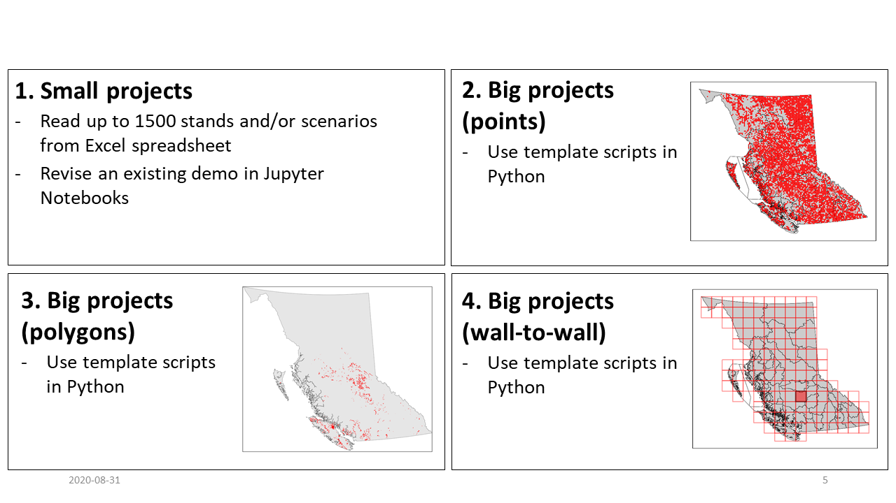

# fcgadgets
## FEATURES
The **fcgadgets** package supports greenhouse gas (GHG) balance estimation, accounting, and reporting in British Columbia’s forest sector. The package is written in the Python 3/Jupyter environment, benefiting from stable integrated libraries for simulation modelling, geographical information systems, data analytics, and application deployment (Downey, 2017). 

The **fcgadgets** package was developed to: 
* Organize code resources used by the Forest Carbon Initiative (https://www2.gov.bc.ca/gov/content/environment/natural-resource-stewardship/natural-resources-climate-change/natural-resources-climate-change-mitigation/forest-carbon-initiative)
* Share knowledge, methods and limitations
* Streamline workflow specific to data systems in BC
	* Vegetation Resource Inventory (VRI)
	* Reporting Silviculture Updates and Land Status Tracking System (RESULTS)
	* Growth and yield models
* Build synergy between existing and new approaches to GHG balance estimation in the forest sector
* Apply the information gained from experiments and monitoring programs to address complex problems in natural resource management

## CBRUNNER

The **cbrunner** subpackage simulates the greenhouse gas (GHG) balance of the forest sector under various management scenarios. The main module (cbrunner.cbrun.py) configures a hierarchical structure of forest stands, batches, scenarios, and ensembles. The total number of simulations for a project is equal to:

**Equation 1:** N_Simulation = N_Stands × N_Batches × N_Scenarios × N_Ensembles

Forest stands are the primary modelling unit in GHG estimation methods. Forest stands comprise an area of homogeneous conditions at the time a project is established (i.e., treatment area). Each stand is described by a representative inventory record, disturbance and management event history (DMEH), and age response functions of forest growth. See section 5 - Biophysical Methods for additional details.
Projects with NStand > 1,500 are segmented internally into batches that are run in sequence in order to work within the memory limits of individual work machines. Batch size (e.g., 1,500) is adjustable, but the batch size that optimizes simulation runtime, tends to be ~1,500 stands per unique combination of scenario and ensemble. 
Input and output variables are organized by scenario to facilitate comparison of baseline and project scenarios. 
Multiple ensembles occur when project configuration specifies a stochastic component to simulations. This generally only occurs if users incorporate simulations of the annual probability of tree mortality or annual probability of tree establishment and recruitment. 
Upon running simulations, the cbrunner.cbrun.py module calls the module, cbrunner.cbrun_utilities.py, to compile project and scenario parameters, and initialize variables, and it calls the module, cbrunner.cbrun_annproc.py, to simulate annual carbon dynamics.

### BiomassFromTASSorTIPSY: 
* Simulates tree biomass dynamics on an annual basis based on inputs of net biomass growth from the TASS/TIPSY growth and yield software application (https://www2.gov.bc.ca/gov/content/industry/forestry/managing-our-forest-resources/forest-inventory/growth-and-yield-modelling)
* Default settings assume inputs generated with BatchTIPSY.exe, but this can be overridden to input tables generated with TASS
### BiomassFromSawtooth:
* Simulates biomass dynamics of individual trees (Hember et al., 2019; Hember and Kurz, 2018)
* Distance-independent representation of resource competition
* Driven by equations of annual aboveground biomass growth, annual probability of recruitment, and annual probability of mortality
* Equations are fitted against species/region samples (SRSs)
### DOM_From_CBM08: 
* Simulates cycling of organic carbon through:
	* dead wood (snags and coarse woody debris);
	* litter (organic soil horizon); 
	* soil (mineral soil horizon);
	* felled & piled materials
* Loosely based on methods described by Kurz et al. (2009)
### DisturbanceAndManagement: 
* A custom Python method designed to represent wildfire, insects, disease, and management treatments
* Optional on-the-fly simulation of natural disturbances or management activities (based on functions of age or merchantable volume)
Harvested wood products:
### HWP_From_Dymond12: 
* Representation of GHG balance for fibre that is removed from forest ecosystems. This module aims to capture the dynamics described by the BC Harvested Wood Products model version 1 (Dymond, 2012).
* Driven by default (province-wide) parameters or user-specified rates of utilization and product profiles
## ACTIVITIES
The **activities** subpackage contains resources for representing effects of forest management on forest sector GHG balance.
### nutrient_addition:
* Representation of GHG balance responses to aerial applications of Urea.
## TAZ
The **taz** subpackage contains resources for representing natural disturbances.
### general_stat_models:
* Equations for simulating annual probability of various discrete events
### wildfire_stat_models:
* Equations for simualating annual probability of wildfire
* Simple equations based on Pareto distribution fits to annual area burned, stratified by biogeoclimatic zone
## UTILITIES
The **utilities** subpackage contains general utilities (custom scripts) to support implementation of cbrunner and accompanying modules.
### 
* Pre-processing script template to prepare **cbrunner** inputs for a:
	* Tile or multi-tile project (get_inventory_for_tile.py)
	* Sample of points (get_inventory_from_points.py)
	* Sample of polygons (get_inventory_from_polygons.py)
* Methods for pre-processing spatial information from: 
	* VRI 
	* RESULTS (forest cover, activity treatments, planting)
	* Aerial Overview Survey
	* Wildfire perimiters

## DEPENDENCIES
Much of the in-house background science and analysis in support of the fcgadgets package is organized in the **fcexplore** package. The spatial reference system for many projects relies on information and processing from the **BC1ha** package.

## WORKFLOW
There are four ways to apply cbrunner depending on the nature of the desired project. Small projects – with fewer than 1,500 combinations of locations or scenarios – can be run from a Jupyter Notebook. The work simply involves populating two Excel spreadsheets with the input variables and parameters. Bigger projects are scripted in Python and can adopt existing templates for projects that focus on running simulations at point locations, or across scattered polygons, or across continuous regular grids.

### Small projects (with Jupyter Notebooks)
When projects consist of fewer than 1,500 unique combinations of stand and/or scenario (e.g., see FCI project demos), cbrunner can be applied with assumptions set directly in the ProjectConfig.xlsx spreadsheet. It is recommended that the project script for small projects make use of Jupyter Notebooks (.ipynb files).
Project workflow:
1. Define project-level parameters in ProjectConfig.xlsx.
2. Define scenario-level parameters in ProjectConfig.xlsx.
3. Parameterize input parameters for BatchTIPSY.exe in the file, GrowthCurvesTIPSY_Parameters.xlsx. This can be done manually for small projects.
4. Convert input parameters to a format readable by BatchTIPSY.exe (automated by running fcgadgets.cbrunner.cbrun_utilities.py.BuildTIPSYInputs).
5. Run BatchTIPSY.exe.
6. Prepare inventory. (automated)
7. Prepare disturbance and management event history. (automated)
8. Prepare growth curves. (automated)
9. Run the simulation and save the outputs by calling the method RunProject. 
10. Import output variables to analysis session by calling LoadScenarioResults. 
11. Calculate GHG balance variables, including net sector greenhouse gas balance by calling the method CalculateGHGBalance.

## TIPS
* The **meta** dictionary tracks all necessary information about a project. 

## REFERENCES
Downey, A.B., 2017. Modeling and Simulation in Python – Green Tea Press, 2.3. ed. Green Tea Press, Needham, Massaschusetts.

Dymond, C.C., 2012. Forest carbon in North America: annual storage and emissions from British Columbia’s harvest, 1965-2065. Carbon Balance and Management 7, (24 July 2012)-(24 July 2012).

Hember, R.A., Kurz, W.A., 2018. Low tree-growth elasticity of forest biomass indicated by an individual-based model. Forests 9, 21. https://doi.org/10.3390/f9010021

Hember, R.A., Kurz, W.A., Girardin, M.P., 2019. Tree Ring Reconstructions of Stemwood Biomass Indicate Increases in the Growth Rate of Black Spruce Trees Across Boreal Forests of Canada. Journal of Geophysical Research: Biogeosciences 124, 2460–2480. https://doi.org/10.1029/2018JG004573

Kurz, W.A., Dymond, C.C., White, T.M., Stinson, G., Shaw, C.H., Rampley, G.J., Smyth, C., Simpson, B.N., Neilson, E.T., Trofymow, J.A., Metsaranta, J., Apps, M.J., 2009. CBM-CFS3: A model of carbon-dynamics in forestry and land-use change implementing IPCC standards. Ecological Modelling 220, 480–504. https://doi.org/10.1016/j.ecolmodel.2008.10.018 

## License

    Copyright 2020 Province of British Columbia

    Licensed under the Apache License, Version 2.0 (the "License");
    you may not use this file except in compliance with the License.
    You may obtain a copy of the License at

    http://www.apache.org/licenses/LICENSE-2.0

    Unless required by applicable law or agreed to in writing, software distributed under the License is distributed on an "AS IS" BASIS,
    WITHOUT WARRANTIES OR CONDITIONS OF ANY KIND, either express or implied.
    See the License for the specific language governing permissions and limitations under the License.

------------------------------------------------------------------------

