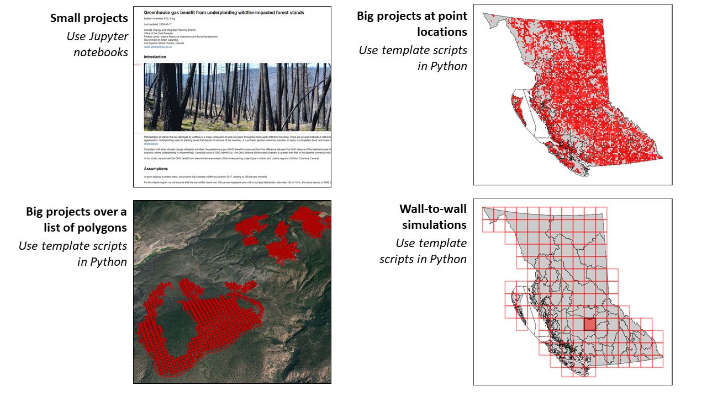

# fcgadgets
## INTRODUCTION
The **fcgadgets** repository supports estimation, accounting, and reporting of greenhouse 
gas (GHG) emissions in British Columbia’s forest sector. The repository is a toolbox that 
offers flexible processing and outputs the variables required to meet international 
reporting standards for the forest sector, or complete life cycle assessments.
 
The repository was developed to: 
* Achieve transparency and reproduceability as commitments to open government and open 
science standards
* Share knowledge, methods and limitations
* Automate and streamline workflow
* Promote a diverse ecosystem of existing and new modelling approaches
* Support complex policy decisions in land resource management
 
 
The <b>fcgadgets</b> repository was written in the Python programming language, benefitting 
from integrated libraries for simulation modelling, geographical information systems, data 
analytics, and application deployment (Downey, 2017). 
 
The <b>fcgadgets</b> repository was designed for a community that conducts forest carbon 
modelling full time. Users must be fluent in the Python language. Trying to apply 
fcgadgets without assistance is not advised. That said, it is relatively straightforward 
to set up small projects that demonstrate dynamics for a single site. 
 
 
## PLUG-AND-PLAY MODULARITY
The repository allows for comprehensive representation of processes and new science by connecting a constellation of supporting modules.

## CBRUNNER
**cbrunner** is a computer simulation model that estimates the greenhouse gas (GHG) balance of the forest sector, including forest ecosystems and 
wood products. The annual net flux of GHGs between the forest sector and the atmosphere is estimated by simulating several biophysical processes each year, including the 
biomass dynamics of trees, the decay and physical transformation of dead organic matter, the impact of natural disturbances, harvest removals, silvicultural treatments, and 
nutrient applications. 

The model achieves this with a set of plug-and-play functions found in **cbrun_annproc.py**:
### Tree Biomass Dynamics (from Growth and Yield models): 
* Simulates tree biomass dynamics on an annual basis based on inputs of net biomass growth from the [TASS/TIPSY growth and yield software application](https://www2.gov.bc.ca/gov/content/industry/forestry/managing-our-forest-resources/forest-inventory/growth-and-yield-modelling).
* Default settings assume inputs generated with BatchTIPSY.exe, but this can be overridden to input tables generated with TASS
* Total stemwood growth is frequently zero for as much as 25 years during early stand development. This leads to underestimation of early biomass production when using 
allometric relationships between stemwood and other biomass pools. To avoid this, initial inputs of stemwood growth for the first 30 years of stand development are replaced 
with exponential increase in total stemwood biomass from 0 to the prediction at age 30. The exponential coefficient is solved such that net growth over the 30-year period 
will match that originally predicted by the GY model.
### Tree Biomass Dynamics (from Sawtooth):
* Simulates biomass dynamics of individual trees (Hember et al., 2019; Hember and Kurz, 2018)
* Distance-independent representation of resource competition
* Driven by equations of annual aboveground biomass growth, annual probability of recruitment, and annual probability of mortality
* Equations are fitted against species/region samples
### Dead Wood, Litter and Soil Dynamics
* Simulates cycling of organic carbon through:
	* Dead wood (snags and coarse woody debris);
	* Litter (organic soil horizon); 
	* Soil (mineral soil horizon);
	* Felled & piled materials
* Based on methods described by Kurz et al. (2009) and Shaw et al. (2014)
* Includes additional representation of piles
### Disturbance and Management Events: 
* This method imposes changes caused by natural disturbances and management events
* All events are defined by an event ID, decimal year, mortality factor, growth factor, and the ID of the growth curve that represents the new stand
* It is driven by the event chronology, which has two potential sources:
	* Prescribed by the user as input variables in the Disturbance and Management Event Chronology (DMEC)
	* Optional on-the-fly simulation of natural disturbances or management activities (based on functions of age or merchantable volume at the beginning of the year)

### Product Dynamics
* Representation of the annual GHG fluxes that arise from fibre that is removed from forest ecosystems
* Fate of removed fibre
* Product types
* Scenarios describing change in the fate of removed fibre and product types

### Geological Dynamics
This method represents annual GHG fluxes associated with:
* Forest sector operations (e.g., use of fossil fuels during hauling)
* Substitution of fossil fuels and cement for wood products 

### Organizational Structure of cbrunner
The **cbrunner** model has a hierarchical structure of forest stands, batches, scenarios, and ensembles:

NSimulation = NStands × NBatches × NScenarios × NEnsembles

Forest stands are the primary modelling unit in GHG estimation methods, and define an area of homogeneous conditions at the time a project is established 
(i.e., treatment area). Each stand is described by an inventory record, disturbance and management event chronology (DMEC), and age response functions of forest growth 
(if using a GY model). 

Projects with NStands > 1,500 are segmented internally into batches that are run in sequence in order to work within the memory limits of individual 
work machines. Batch size (e.g., 1,500) is adjustable, but the batch size that optimizes simulation runtime, tends to be ~1,500 stands per unique combination of scenario and 
ensemble. 

### Scenarios Comparisons
Projects that explore climate change impacts or mitigation activities invariably consider multiple hypothetical scenarios for each forest stand. The hierarchical structure and post-processing scripts are
therefore built around running and comparing multiple scenarios.

### Uncertainty and Ensemble Forecasting
The **cbrunner** model adopts a probabilistic framework to accommodate processes with both deterministic and random components, as well as uncertainty analysis. Multiple ensembles
occur when project configuration specifies a stochastic component to simulations. This generally only occurs if users incorporate simulations of the annual 
probability of tree mortality or annual probability of tree recruitment. 

### Working with Growth & Yield models

The **cbrunner** model can be driven with output from [TASS/TIPSY growth and yield (GY) modelling applications](https://www2.gov.bc.ca/gov/content/industry/forestry/managing-our-forest-resources/forest-inventory/growth-and-yield-modelling) using automated functions in **cbrun_utilities.py**.
* Prepare input parameters that are required to run BatchTIPSY.exe in a spreadsheet with **Write_BatchTIPSY_Input_Spreadsheet**
* Convert the spreadsheet of input parameters to the format expected by BatchTIPSY.exe using **Write_BatchTIPSY_Input_File**
* Convert the output from BatchTIPSY.exe to pickle files that will be read by cbrunner using **PostProcessBatchTIPSY**
* Convert the output from TASS for use in cbrunner with **GetTASSCurves**
* Import GY curves into a work session with **Import_BatchTIPSY_Output**

### Model Output Statistics
Once simulations are complete, use a series of functions in **cbrun_util.py** to summarize model output statistics (MOS).
* Import simulation output variables for a given scenario, ensemble, and batch using **LoadSingleOutputFile**
* Import simulation output variables for a given scenario using **LoadScenarioResults**
* Calculate the mean and variance of ensemble simulations using **ModelOutputStats**
* When projects have been run for multi-polygon openings from RESULTS, model outputs can be summarized while preserving the exact treatment area that is specified for each multi-polygon using **MosByMultipolygon**

## MACGYVER
The **macgyver** toolbox contains custom scripts that compile information sources and prepare projects that use **cbrunner**. If pre-processing steps are similar among a wide range of project types, the goal is to store the scripts here for shared useage. 
* Pre-processing script template to prepare **cbrunner** inputs for a:
	* Sample of points
	* Sample of polygons
	* Tile or multi-tile project
* Methods for processing spatial information from: 
	* Vegetation Resource Inventory (VRI)
	* Reporting Silviculture Updates and Land Status Tracking System (RESULTS)
	* Wildfire perimiter and burn severity databases
	* Aerial overview (forest insects and disease) survey
	* Strategic land and resource plans
	* ClimateNA base-period mean climate
	* Growth and yield models

### util_inventory.py
The general workflow of **cbrunner** projects rely on the use of look-up tables (LUTs) for each variable in the inventory layers within Results.gdb, VRI.gdb, Disturbance.gdb, and LandUse.gdb.

### util_general.py
This module contains general utilities for workflow in Python.

### util_gis.py
This module contains utilities for performing spatial analysis in Python.

## TAZ
Forest sector GHG balance simulations depend on realistic variation of natural disturbances over space and time. While inventory records provide much of the information needed 
to represent natural disturbances over the modern era, additional simulations are needed to represent disturbances over the pre-inventory and future periods. The **taz** subpackage was developed to improve representation of disturbances in carbon models. It consists of statistics and scenarios of disturbance that were developed using a combination of observed constraints and probabilistic models. Despite 
high prediction uncertainty, using the pre-defined scenarios ensures that representation of natural disturbances is grounded by available observations and science-informed 
scenarios, consistent across project studies, and supported by documentation.
### aspatial_stat_models.py 
* Statistical models of breakup as a function of stand age
* Statistical models of harvest as a function of standing merchantable volume 
* Annual area of occurrence (AAO) models of wildfire and beetles 
### onset_spread_models.py
* Spatially explicit simulations of events based on annual probability of onset and spread

## HARDHAT
The **hardhat** toolbox contains resources for representing effects of forest management on forest sector GHG balance.
### nutrient_application.py
The nutrient_application module contains functions that update annual nutrient status called by the cbrunner model and a function that schedules hypothetical nutrient applications (during the future period of simulation).
* Representation of GHG balance responses to aerial applications of Urea
* Schedule aerial nutrient applications with specified stand selection criteria
#### Update nutrient status
All effects of nutrient application were expressed in cbrunner by prescribing a “Fertilization Areal” event during a specified calendar year in the disturbance and management event chronology (DMEC) – a set of variables that are input to cbrunner for each site. The occurrence of “Fertilization Aerial” events triggered the function, UpdateStatus, which:
1.	Started a timer that eventually terminates stimulus at the specified response duration; 
2.	Modified emissions to account for manufacture and transport;
3.	Modified emissions to account for nitrous oxide (N2O) fluxes; 
4.	Modified net growth rate of tree biomass pools;
5.	Modified turnover of tree biomass pools; 
6.	Modified decomposition rate. 
#### Nutrient application scheduler
Hypothetical future applications were scheduled by calling the function, ScheduleApplication. The scheduler was defined by a fixed annual probability of aerial nutrient application (PNAP) for stands meeting the following exclusion criteria: 
1.	Dry biogeoclimatic (BGC) zones, including Bunchgrass, Ponderosa Pine and Interior Douglas-fir; 
2.	Cold BGC zones, including Mountain Hemlock and Spruce-Willow-Birch; 
3.	Site index at 50 years < 8 m; 
4.	Stand age < 10
5.	Stand age > 61 years; 
6.	Time since nutrient application < 10 years. 
Historically, the public forest fertilization program split operations evenly between coastal and interior regions. However, the area of the interior region exceeds that of the coast. The scheduler was set to continue the historical split between regions by making PNAP region specific.
### economics.py
* Calculate cashflow from implementation of forest management events

## BC1HA
The BC1ha toolbox supports raster processing on a 1 hectare regular grid of British Columbia 

## PROJECT WORKFLOW
There are four ways to apply **cbrunner** depending on the nature of the desired project. Small projects – with fewer than 1,500 combinations of locations or scenarios – can be run from a Jupyter Notebook. The work simply involves populating two Excel spreadsheets with the input variables and parameters. Bigger projects are scripted in Python and can adopt existing templates for projects that focus on running simulations at point locations, or across scattered polygons, or across continuous regular grids.

## SMALL PROJECTS (WITH JUPYTER NOTEBOOKS)
When projects consist of fewer than 20 stands, or 20 scenarios for one stand, **cbrunner** can be controlled by spreadsheet and run within Jupyter Notebooks. Assumptions about the event chronology for each scenario can be set manualy in the ProjectConfig.xlsx spreadsheet, while assumptions about stand growth from BatchTIPSY.exe can be manually set in GrowthCurvesTIPSY_Parameters.xlsx. 

When the number of ensembles exceeds one, the model knows to treat stands like ensembles (i.e. N_Stand = N_Ensemble for each scenario). This makes it lightning fast to run 1,000s of ensembles. Even if some scenarios have no stochastic simulations, N_Ensemble is a project-level parameter that cannot be differentatied among scenarios.

## REFERENCES
Downey, A.B., 2017. Modeling and Simulation in Python – Green Tea Press, 2.3. ed. Green Tea Press, Needham, Massaschusetts.

Dymond, C.C., 2012. Forest carbon in North America: annual storage and emissions from British Columbia’s harvest, 1965-2065. Carbon Balance and Management 7, (24 July 2012)-(24 July 2012).

Hember, R.A., Kurz, W.A., 2018. Low tree-growth elasticity of forest biomass indicated by an individual-based model. Forests 9, 21. https://doi.org/10.3390/f9010021

Hember, R.A., Kurz, W.A., Girardin, M.P., 2019. Tree Ring Reconstructions of Stemwood Biomass Indicate Increases in the Growth Rate of Black Spruce Trees Across Boreal Forests of Canada. Journal of Geophysical Research: Biogeosciences 124, 2460–2480. https://doi.org/10.1029/2018JG004573

Kurz, W.A., Dymond, C.C., White, T.M., Stinson, G., Shaw, C.H., Rampley, G.J., Smyth, C., Simpson, B.N., Neilson, E.T., Trofymow, J.A., Metsaranta, J., Apps, M.J., 2009. CBM-CFS3: A model of carbon-dynamics in forestry and land-use change implementing IPCC standards. Ecological Modelling 220, 480–504. https://doi.org/10.1016/j.ecolmodel.2008.10.018 

Shaw, C.H., Hilger, A.B., Metsaranta, J., Kurz, W.A., Russo, G., Eichel, F., Stinson, G., Smyth, C., Filiatrault, M., 2014. Evaluation of simulated estimates of forest ecosystem carbon stocks using ground plot data from Canada’s National Forest Inventory. Ecological Modelling 272, 323–347.

## License

    Copyright 2020 Province of British Columbia

    Licensed under the Apache License, Version 2.0 (the "License");
    you may not use this file except in compliance with the License.
    You may obtain a copy of the License at

    http://www.apache.org/licenses/LICENSE-2.0

    Unless required by applicable law or agreed to in writing, software distributed under the License is distributed on an "AS IS" BASIS,
    WITHOUT WARRANTIES OR CONDITIONS OF ANY KIND, either express or implied.
    See the License for the specific language governing permissions and limitations under the License.

------------------------------------------------------------------------

