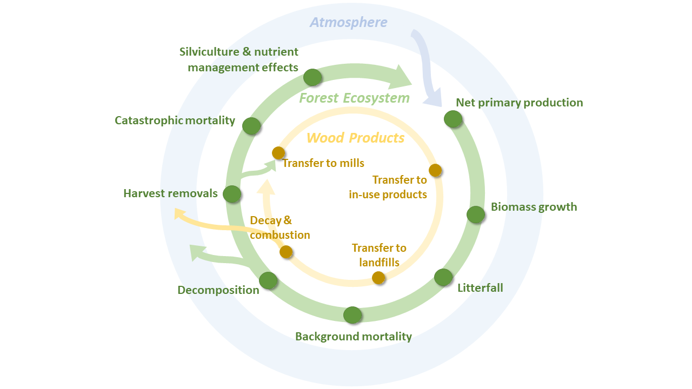

# fcgadgets
## INTRODUCTION
The **fcgadgets** package supports greenhouse gas (GHG) balance estimation, accounting, and reporting in British Columbia’s forest sector. The package is written in the Python 3/Jupyter environment, benefiting from stable integrated libraries for simulation modelling, geographical information systems, data analytics, and application deployment (Downey, 2017). 

The **fcgadgets** package was developed to: 
* Consolidate source code used by BC's Forest Carbon Initiative
* Share knowledge, methods and limitations
* Streamline project setup and integration with BC information systems
* Automate pre- and post-processing project workflow
* Benefit from the diverse ecosystem of existing and new modelling approaches
* Apply the information gained from experiments and monitoring programs to support complex policy decisions in natural resource management

## FEATURES
* Explore the effects of aerial Urea application on the annual GHG balance of a forest stand
* Explore the effects of underplanting on the annual GHG balance of a forest stand
* Explore the effects of salvage logging on the annual GHG balance of a forest stand
* Simulate the forest carbon balance at set of regular points
* Simulate the forest carbon balance across a set of vector treatment areas distributed across BC
* Simulate high-resolution, wall-to-wall coverage of a watershed or timber supply area

## CBRUNNER
The **cbrunner** subpackage is a computer simulation model that estimates the greenhouse gas (GHG) balance of the forest sector, including forest ecosystems and wood products.
The annual net flux of GHGs between the forest sector and the atmosphere is estimated by simulating several biophysical processes each year, including the biomass dynamics of trees,
the decay and physical transformation of dead organic matter, the impact of natural disturbances, harvest removals, silvicultural treatments, and nutrient applications. 

The model achieves this with a set of plug-and-play functions, currently consisting of:
### Biomass_FromTIPSYorTASS: 
* Simulates tree biomass dynamics on an annual basis based on inputs of net biomass growth from the TASS/TIPSY growth and yield software application (https://www2.gov.bc.ca/gov/content/industry/forestry/managing-our-forest-resources/forest-inventory/growth-and-yield-modelling).
* Default settings assume inputs generated with BatchTIPSY.exe, but this can be overridden to input tables generated with TASS
* Total stemwood growth is frequently zero for as much as 25 years during early stand development. This leads to underestimation of early biomass production when using allometric relationships between stemwood and other biomass pools. To avoid this, initial inputs of stemwood growth for the first 30 years of stand development are replaced with exponential increase in total stemwood biomass from 0 to the prediction at age 30. The exponential coefficient is solved such that net growth over the 30-year period will match that originally predicted by the GY model.
### Biomass_FromSawtooth:
* Simulates biomass dynamics of individual trees (Hember et al., 2019; Hember and Kurz, 2018)
* Distance-independent representation of resource competition
* Driven by equations of annual aboveground biomass growth, annual probability of recruitment, and annual probability of mortality
* Equations are fitted against species/region samples
### DOM_FromCBM08: 
* Simulates cycling of organic carbon through:
	* Dead wood (snags and coarse woody debris);
	* Litter (organic soil horizon); 
	* Soil (mineral soil horizon);
	* Felled & piled materials
* Loosely based on methods described by Kurz et al. (2009)
### DisturbanceAndManagement: 
* This method imposes changes caused by natural disturbances and management events
* All events are defined by an event ID, decimal year, mortality factor, growth factor, and the ID of the growth curve that represents the new stand
* It is driven by the event chronology, which has two potential sources:
	* Prescribed by the user as input variables in the Disturbance and Management Event Chronology (DMEC)
	* Optional on-the-fly simulation of natural disturbances or management activities (based on functions of age or merchantable volume at the beginning of the year)

### HWP_FromDymond12: 
* Representation of teh annual GHG balance for fibre that is removed from forest ecosystems 
* This module aims to capture the dynamics described by the BC Harvested Wood Products model version 1 (Dymond, 2012) (https://www2.gov.bc.ca/gov/content/environment/natural-resource-stewardship/natural-resources-climate-change/natural-resources-climate-change-mitigation/tools-resources)
* Driven by default (province-wide) parameters or user-specified rates of utilization and product profiles

### Organizational structure
The **cbrunner** model has a hierarchical structure of forest stands, batches, scenarios, and ensembles:

NSimulation = NStands × NBatches × NScenarios × NEnsembles

Forest stands are the primary modelling unit in GHG estimation methods, and define an area of homogeneous conditions at the time a project is established 
(i.e., treatment area). Each stand is described by an inventory record, disturbance and management event chronology (DMEC), and age response functions of forest growth 
(if using a GY model). 

Projects with NStands > 1,500 are segmented internally into batches that are run in sequence in order to work within the memory limits of individual 
work machines. Batch size (e.g., 1,500) is adjustable, but the batch size that optimizes simulation runtime, tends to be ~1,500 stands per unique combination of scenario and 
ensemble. 

### Scenarios & probabilistic modelling framework
Projects that explore climate change impacts or mitigation activities invariably consider multiple hypothetical scenarios for each forest stand. the hierarchical structure is
therefore built around running and comparing multiple scenarios.

The **cbrunner** model adopts a probabilistic framework to accommodate processes with both deterministic and random components, as well as uncertainty analysis. Multiple ensembles
occur when project configuration specifies a stochastic component to simulations. This generally only occurs if users incorporate simulations of the annual 
probability of tree mortality or annual probability of tree recruitment. 

### Plug-and-play modularity
The **cbrunner** model achieves comprehensive, granular representation of processes through links to a constellation of supporting modules also stored in **fcgadgets**.

## UTILITIES
The **utilities** module contains general custom scripts to support implementation of cbrunner and supporting modules. The **utilities** module allows all **cbrunner** projects to 
effectively and consistently communicate with forest inventory databases.
* Pre-processing script template to prepare **cbrunner** inputs for a:
	* Tile or multi-tile project (get_inventory_for_tile.py)
	* Sample of points (get_inventory_from_points.py)
	* Sample of polygons (get_inventory_from_polygons.py)
* Methods for processing spatial information from: 
	* Vegetation Resource Inventory (VRI)
	* Reporting Silviculture Updates and Land Status Tracking System (RESULTS)
	* Wildfire perimiter and burn severity databases
	* Aerial overview (forest insects and disease) survey
	* Strategic land and resource plans
	* ClimateNA base-period mean climate
	* Growth and yield models

### Look-up Tables
The general workflow of **cbrunner** projects rely on the use of look-up tables (LUTs) for each variable in the inventory layers within Results.gdb, VRI.gdb, Disturbance.gdb, and LandUse.gdb. The purpose of the LUTs was to: 
1.	Create a list of the subset of variables from each layer that are needed for modelling (utilities_inventory.DefineInventoryLayersAndVariables);
2.	Assign unique numerical identifiers to each code found in the variables that are stored as strings in the geodatabase (utilities_inventory.BuildForestInventoryLUTs). 
Filtering out unnecessary variables, and converting all retained variables to numeric data types, improved ease of subsequent programming, memory requirement, and storage space. One exception included variables that were stored as date strings within the various inventory layers. Date string variables were converted to a numeric data type upon later compilation of each inventory layer. 
Species codes occurred across multiple inventory layers. As coherence among the lists of unique species codes from each layer could not be guaranteed, the script tallied all unique species codes across layers and repopulated the LUT for species codes for each layer with a complete, global set of species codes. 
The LUTs for each inventory layer were stored as pickle files.

### Query Inventory Layers
The script, fciproscripts.rollup.FCI_Rollup_00_FromInv_QueryFCI.py, scanned the Results.gdb.RSLT_ACTIVITY_TREATMENT_SVW layer to find projects that were completed and funded by FCI and archive the treatment areas. Completed FCI projects were defined by two criteria:
1)	Those that were completed (RESULTS_IND = “Y”) and
2)	those that were funded by FCI (SILV_FUND_SOURCE_CODE = “FCE” or SILV_FUND_SOURCE_CODE = “FCM”) or those with FIA_PROJECT_ID that are present in the FCI Admin Table. The latter condition accounted for projects that FESBC deemed carbon eligible, but with FIA_PROJECT_ID = “FES”. 
Regrettably, this meant that FESBC projects that were not eligible and not funded by LCELF entered the query. This occurred because there was not a unique crosswalk between Results.gdb.RSLT_ACTIVITY_TREATMENT_SVW and the FESBC database. A solution was not attainable, and the projects were manually removed from the dataset.
The resulting query, herein called “FCI query,” included all activities submitted to RESULTS. Activities that met the query statements were added to a list variable. The list retained all attributes from Results.gdb.RSLT_ACTIVITY_TREATMENT_SVW within a dictionary in each element of the list variable. The geometries could have multipolygon types. The script scanned through the multipolygons and added the geometries to a list called “Blocks”. 
Prior to update of the RESULTS information submission guide to make it mandatory to submit spatial geometries for all FCI and FFT silviculture activities in January 2020, some projects were not submitting geometries. After the query of Results.gdb.RSLT_ACTIVITY_TREATMENT_SVW completed, missing geometries were replaced by scanning through Results.gdb.RSLT_OPENING_SVW for matching values of OPENING_ID. The geometry from the opening was added to the FCI query, noting frequent discrepancies between treatment area and opening area. 
The FCI query was saved to a pickle file and shapefile.

### Define Sparse Grid Sample
While inventory data were maintained in vector format, a raster database was adopted for modelling and analysis. The system defined a grid sample across BC and then extracted a sparse sample of the grid cells that fell within the FCI query. This was achieved with the script, fciproscripts.rollup.FCI_Rollup_01_FromInv_CreateSparseGrid.py. The spatial sampling resolution was set to 100 m. 
Milestones in the FCI query that did not lead to a GHG benefit (e.g., surveys) were excluded from the sparse grid. Some milestones in the FCI query were missed by the 100 m sampling resolution. When this occurred, the script iteratively attempted to sample from a higher spatial frequency until a single grid cell within the treatment area was identified. As such, although a regular grid was the foundation for sampling, the final sparse grid sample included some irregular spatial sampling. 
Once the sparse grid sample had been defined, overlay between sparse grid and each inventory layer was performed to compile attributes at each sample cell. This was achieved by looping through the FCI query, and then sub-looping though each block (i.e., each polygon in the multipolygon geometry) for each entry in the FCI query list. Only the attributes identified in the LUT for each inventory layer were retained and added to a list. 
Some inventory variables were date strings. As all inventory data were stored in numeric data type moving forward, the date string variables were broken down into numeric fields for year, month and day. The original date strings were then deleted.

### Prepare Simulation Assumptions and Inputs
To apply the model, the following input files were prepared:
•	Inventory summary
•	Disturbance and management event history
•	Age responses of net biomass growth
These files were compiled in the script, fciproscripts.rollup.FCI_Rollup_02_FromInv_PrepCBRun.py. 
Inventory and growth curve files were specific to unique combinations of scenario and batch. 

### Disturbance and Management Event Chronology
Disturbance and management event chronology (DMEC) files were specific to unique combinations of scenario, batch, and ensemble. The inventory file was produced automatically. There were three information sources for events listed in the DMEH that include tree mortality:
1.	Prescribed from BC inventory records;
2.	Simulated by a user-specified models; 
3.	Gap-filled. 
Compilation of the DMEC started by adding information available from inventory data. For example, much was known about previous harvests, wildfires, and beetle outbreaks from BC disturbance databases. 
Simulated events were added automatically later in the script according to the spin-up and future disturbance assumptions in the ProjectConfig.xlsx file for the project. 

### Gap-filled Events
Some contexts require the analyst to add events to the DMEH that were not informed by disturbance databases, or simulation modelling. These are referred to as gap-filled events. Gap-filled events required some scrutiny granted that they were subjective in nature. 
For example, consider a grid cell where the inventory indicated no 2017 wildfire, but the recipient indicated that a wildfire occurred in that year. Here, FCI assumed that the absence of the event reflected an omission (false negative) error in the disturbance databases, and the event was added to the DMEH. 
As a second example, consider a Dwarf Mistletoe Control milestone. The onset of Dwarf Mistletoe in that stand at some time prior to the milestone is not informed by the disturbance database or simulation modelling. Instead, it is inherently assumed to occur and added at the year following the first stand-replacing disturbance of the modern era by the analyst.
The baseline scenario in planting projects required transition to an age response of net growth for a stand that regenerates naturally following the previous stand-replacing disturbance. However, in some cases BC disturbance databases did not record a disturbance in the modern era. Because the preparation of age responses occurs in the pre-processing, the last disturbance event in the spin-up era could not act as the preceding event. In such cases, a previous stand-replacing disturbance was added to the beginning of the modern era. 
As site preparation and forest health milestones can precede stand establishment, they can appear in the FCI query as completed. If a future planting event is not added, the GHG balance will not reflect the expected outcome. As such, when those milestones are not accompanied by subsequent stand establishment, a planting event is added to the analyst to support program summarization in real time. 

### Back-to-back Planting Events
There were instances of planting events in back-to-back years. These drive up the number of growth curves and can cause erroneous results in some cases. They could have indicated fill-planting or re-planting following partial or complete regeneration failure, respectively. However, in instances where the planting events were not accompanied by spatial geometries, it is also possible that back-to-back planting events simply reflected a single treatment area that was spread over two calendar years (herein called multi-year projects). In those cases, planting from each event likely occurred on two distinct sub-areas of the whole treatment area. However, because missing spatial information for the treatment area is filled by geometry of the opening, the events are perceived as repeated planting events on at the exact same location. One could establish rules based on planting density and treatment area to discern whether it was likely fill planting vs. multi-year projects. For now, FCI simply omits the second of the two planting events.

### Best-available Variables
The script then compiled a “best available” version of many inventory variables that were used to parameterize BatchTIPSY.exe. Unrecognized species codes were all converted to those recognized by BatchTIPSY.exe. For baseline scenarios, the best-available species composition was compiled first from any previous planting information (generally absent), then from the forest cover silviculture layer, then from the forest cover inventory layer, then from VRI, and finally from regional assumptions. For project scenarios with planting, species composition was drawn from the planting layers. For non-planting project scenarios, selection rules followed that of the baseline scenario.
In order of preference, best-available site index was created from:
1)	Site Productivity Layer
2)	Forest Cover Inventory layer
3)	Vegetation Resource Inventory layer 
Genetic worth and selection age were commonly provided for a large list of unique combinations of species and genetic worth than can be applied in BatchTIPSY.exe. Final estimates of genetic worth for up to five planted species were calculated by weighting each entry in the planting layer by the number of trees planted.

### Age Response Functions of Net Biomass Growth
Building growth curves for each grid cell was typically unnecessary when there was redundancy in species composition and other stand attributes. For example, although the FCI completed projects could include 33,000 grid cells, there may have only be 5,000 unique stand types. Unique stand types were identified and parameters for each stand type were exported to GrowthCurvesTIPSY_Parameters.xlsx. Then fcgadgets.cbrunner.cbrun_utilities.py.BuildTIPSYInputs was used to build the data input file readable by BatchTIPSY.exe. Then BatchTIPSY.exe was run.
The inventory summaries were saved to pickle file. The DMEHs were then saved to pickle file. At this point, FIZ was used to specify the disturbance return intervals of coastal and interior projects during spin up. Growth curves were then imported from the BatchTIPSY.exe output file and converted to the format required for fcgadgets.cbrunner, and then finally saved to pickle file. Finally, the script executed the function, fcgadgets.cbrunner.cbrun.py.RunProject, to simulate the results.

## TAZ
Forest sector GHG balance simulations depend on realistic variation of natural disturbances over space and time. While inventory records provide much of the information needed 
to represent natural disturbances over the modern era, additional simulations are needed to represent disturbances over the pre-inventory and future periods. In support of the 
BC Forest Carbon Initiative (FCI), statistics and scenarios of natural disturbance were developed using a combination of observed constraints and probabilistic models. Despite 
high prediction uncertainty, using the pre-defined scenarios ensures that representation of natural disturbances is grounded by available observations and science-informed 
scenarios, consistent across project studies, and supported by documentation.
### general_stat_models:
* Equations for simulating annual probability of various discrete events
### wildfire_stat_models:
* Equations for simualating annual probability of wildfire
* Simple equations based on Pareto distribution fits to annual area burned, stratified by biogeoclimatic zone

## ACTIONS
The **actions** module contains resources for representing effects of forest management on forest sector GHG balance.
### nutrient_addition:
* Representation of GHG balance responses to aerial applications of Urea
s

## PROJECT WORKFLOW
There are four ways to apply **cbrunner** depending on the nature of the desired project. Small projects – with fewer than 1,500 combinations of locations or scenarios – can be run from a Jupyter Notebook. The work simply involves populating two Excel spreadsheets with the input variables and parameters. Bigger projects are scripted in Python and can adopt existing templates for projects that focus on running simulations at point locations, or across scattered polygons, or across continuous regular grids.

### Small projects (with Jupyter Notebooks)
When projects consist of fewer than 1,500 unique combinations of stand and/or scenario, assumptions about the event chronology for each scenario can be set manualy in the ProjectConfig.xlsx spreadsheet, while assumptions about stand growth from BatchTIPSY.exe can be manually set in GrowthCurvesTIPSY_Parameters.xlsx. 

Use an existing project template to establish the data folder and the jupyter notebook file.

When the number of ensembles exceeds one, the model swaps stands for ensembles, N_Stand = N_Ensemble for each scenario. Even if some scenarios have no stochastic simulations, N_Ensemble is a project-level parameter that cannot be differentatied among scenarios.

Project workflow entails:
1. Define project-level parameters in ProjectConfig.xlsx.
2. Define scenario-level parameters in ProjectConfig.xlsx.
3. Parameterize input parameters for BatchTIPSY.exe in the file, GrowthCurvesTIPSY_Parameters.xlsx. This can be done manually for small projects.
4. Convert input parameters to a format readable by BatchTIPSY.exe (automated by running fcgadgets.cbrunner.cbrun_utilities.py.BuildTIPSYInputs).
5. Run BatchTIPSY.exe.
6. Prepare inventory. (automated)
7. Prepare disturbance and management event history. (automated)
8. Prepare growth curves. (automated)
9. Run the simulation and save the outputs by calling the method RunProject. 
10. Import output variables to analysis session by calling LoadScenarioResults. 
11. Calculate GHG balance variables, including net sector greenhouse gas balance by calling the method CalculateGHGBalance.

### Big projects (wall to wall)
Simulation across continuous, regular grids is faciliated by a tile system developed for BC. Such projects are supported by the **utilities_tile** module. 

## USEAGE
1. Install Anaconda
2. Create local folder for fcgadgets code and pull fcgadgets from Github
3. Create local folder for project code
4. Create local folder for project data
5. Use jupyter notebook or Python script to prepare project
6. Run fcgadgets.cbrunner.cbrun.MeepMeep
	* data and parameters are imported
	* variables are initialized
	* annual carbon balance is simulated
		* Biomass dynamics
		* Dead organic matter dynamics
		* Disturbance and management events occur
		* Harvested wood products
7.

## TIPS & TRICKS
* The **meta** dictionary tracks all necessary information about a project. It is meant to store parameters and assumptions and levers, but not large data. 

## REFERENCES
Downey, A.B., 2017. Modeling and Simulation in Python – Green Tea Press, 2.3. ed. Green Tea Press, Needham, Massaschusetts.

Dymond, C.C., 2012. Forest carbon in North America: annual storage and emissions from British Columbia’s harvest, 1965-2065. Carbon Balance and Management 7, (24 July 2012)-(24 July 2012).

Hember, R.A., Kurz, W.A., 2018. Low tree-growth elasticity of forest biomass indicated by an individual-based model. Forests 9, 21. https://doi.org/10.3390/f9010021

Hember, R.A., Kurz, W.A., Girardin, M.P., 2019. Tree Ring Reconstructions of Stemwood Biomass Indicate Increases in the Growth Rate of Black Spruce Trees Across Boreal Forests of Canada. Journal of Geophysical Research: Biogeosciences 124, 2460–2480. https://doi.org/10.1029/2018JG004573

Kurz, W.A., Dymond, C.C., White, T.M., Stinson, G., Shaw, C.H., Rampley, G.J., Smyth, C., Simpson, B.N., Neilson, E.T., Trofymow, J.A., Metsaranta, J., Apps, M.J., 2009. CBM-CFS3: A model of carbon-dynamics in forestry and land-use change implementing IPCC standards. Ecological Modelling 220, 480–504. https://doi.org/10.1016/j.ecolmodel.2008.10.018 

## License

    Copyright 2020 Province of British Columbia

    Licensed under the Apache License, Version 2.0 (the "License");
    you may not use this file except in compliance with the License.
    You may obtain a copy of the License at

    http://www.apache.org/licenses/LICENSE-2.0

    Unless required by applicable law or agreed to in writing, software distributed under the License is distributed on an "AS IS" BASIS,
    WITHOUT WARRANTIES OR CONDITIONS OF ANY KIND, either express or implied.
    See the License for the specific language governing permissions and limitations under the License.

------------------------------------------------------------------------

