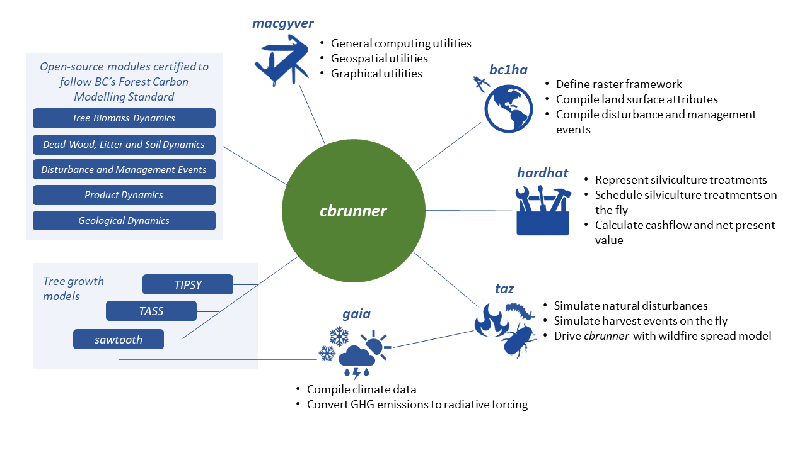

# fcgadgets
## INTRODUCTION
The **fcgadgets** repository supports greenhouse gas (GHG) balance estimation, accounting, and reporting in British Columbia’s forest sector.
 
 
Use **fcgadgets** to quantify the impact of natural processes, land-use decisions, and forest management on the concentration of atmospheric GHGs. Emissions and removals are reported by sector, including Land Use, Land-use Change and Forestry Sector (i.e., forest ecosystems and harvested wood products), Energy - Stationary Combustion Sector, Energy - Transportation Sector, and the Industrial Product and Product Use Sector.
 
  
The repository was developed to: 
* Consolidate source code used by BC's Forest Carbon Initiative (FCI)
* Share knowledge, methods and limitations
* Automate and streamline project design with BC information systems
* Benefit from the diverse ecosystem of existing and new modelling approaches
* Support complex policy decisions in land resource management
 
fcgadgets is written in the Python 3/Jupyter environment, benefitting from integrated libraries for simulation modelling, 
geographical information systems, data analytics, and application deployment (Downey, 2017). 

## PLUG-AND-PLAY MODULARITY
The repository allows for comprehensive representation of processes and new science by connecting a constellation of supporting modules.

## CBRUNNER
**cbrunner** is a computer simulation model that estimates the greenhouse gas (GHG) balance of the forest sector, including forest ecosystems and 
wood products. The annual net flux of GHGs between the forest sector and the atmosphere is estimated by simulating several biophysical processes each year, including the 
biomass dynamics of trees, the decay and physical transformation of dead organic matter, the impact of natural disturbances, harvest removals, silvicultural treatments, and 
nutrient applications. 

The model achieves this with a set of plug-and-play functions fund in **cbrun_annproc.py**:
### Biomass_FromTIPSYorTASS: 
* Simulates tree biomass dynamics on an annual basis based on inputs of net biomass growth from the [TASS/TIPSY growth and yield software application](https://www2.gov.bc.ca/gov/content/industry/forestry/managing-our-forest-resources/forest-inventory/growth-and-yield-modelling).
* Default settings assume inputs generated with BatchTIPSY.exe, but this can be overridden to input tables generated with TASS
* Total stemwood growth is frequently zero for as much as 25 years during early stand development. This leads to underestimation of early biomass production when using 
allometric relationships between stemwood and other biomass pools. To avoid this, initial inputs of stemwood growth for the first 30 years of stand development are replaced 
with exponential increase in total stemwood biomass from 0 to the prediction at age 30. The exponential coefficient is solved such that net growth over the 30-year period 
will match that originally predicted by the GY model.
### Biomass_FromSawtooth:
* Simulates biomass dynamics of individual trees (Hember et al., 2019; Hember and Kurz, 2018)
* Distance-independent representation of resource competition
* Driven by equations of annual aboveground biomass growth, annual probability of recruitment, and annual probability of mortality
* Equations are fitted against species/region samples
### DOM_FromCBM08: 
* Simulates cycling of organic carbon through:
	* Dead wood (snags and coarse woody debris);
	* Litter (organic soil horizon); 
	* Soil (mineral soil horizon);
	* Felled & piled materials
* Based on methods described by Kurz et al. (2009) and Shaw et al. (2014)
### Events_FromTaz: 
* This method imposes changes caused by natural disturbances and management events
* All events are defined by an event ID, decimal year, mortality factor, growth factor, and the ID of the growth curve that represents the new stand
* It is driven by the event chronology, which has two potential sources:
	* Prescribed by the user as input variables in the Disturbance and Management Event Chronology (DMEC)
	* Optional on-the-fly simulation of natural disturbances or management activities (based on functions of age or merchantable volume at the beginning of the year)

### HWP_From_BCHWP12: 
* Representation of the annual GHG fluxes that arise from fibre that is removed from forest ecosystems 
* This module aims to capture the dynamics described by the [BC Harvested Wood Products model version 1 (Dymond, 2012)](https://www2.gov.bc.ca/gov/content/environment/natural-resource-stewardship/natural-resources-climate-change/natural-resources-climate-change-mitigation/tools-resources)
* Driven by province-wide default parameters or user-specified parameters indicating product profiles

### HWP_From_BCHWP12_Update21: 
* Representation of the annual GHG fluxes that arise from fibre that is removed from forest ecosystems (Dymond, 2012)
* Modifications made to include flow of fibre through chipper mills, post & pole mills, and firewood collection
* Modifications made to represent domestric power generation, pellets
* Modifications made to capture regional differences in harvest utilization levels

### Organizational structure of cbrunner
The **cbrunner** model has a hierarchical structure of forest stands, batches, scenarios, and ensembles:

NSimulation = NStands × NBatches × NScenarios × NEnsembles

Forest stands are the primary modelling unit in GHG estimation methods, and define an area of homogeneous conditions at the time a project is established 
(i.e., treatment area). Each stand is described by an inventory record, disturbance and management event chronology (DMEC), and age response functions of forest growth 
(if using a GY model). 

Projects with NStands > 1,500 are segmented internally into batches that are run in sequence in order to work within the memory limits of individual 
work machines. Batch size (e.g., 1,500) is adjustable, but the batch size that optimizes simulation runtime, tends to be ~1,500 stands per unique combination of scenario and 
ensemble. 

### Scenarios comparisons
Projects that explore climate change impacts or mitigation activities invariably consider multiple hypothetical scenarios for each forest stand. The hierarchical structure and post-processing scripts are
therefore built around running and comparing multiple scenarios.

### Uncertainty and ensemble forecasting
The **cbrunner** model adopts a probabilistic framework to accommodate processes with both deterministic and random components, as well as uncertainty analysis. Multiple ensembles
occur when project configuration specifies a stochastic component to simulations. This generally only occurs if users incorporate simulations of the annual 
probability of tree mortality or annual probability of tree recruitment. 

### Working with Growth & Yield models

The **cbrunner** model can be driven with output from [TASS/TIPSY growth and yield (GY) modelling applications](https://www2.gov.bc.ca/gov/content/industry/forestry/managing-our-forest-resources/forest-inventory/growth-and-yield-modelling) using automated functions in **cbrun_utilities.py**.
* Prepare input parameters that are required to run BatchTIPSY.exe in a spreadsheet with **Write_BatchTIPSY_Input_Spreadsheet**
* Convert the spreadsheet of input parameters to the format expected by BatchTIPSY.exe using **Write_BatchTIPSY_Input_File**
* Convert the output from BatchTIPSY.exe to pickle files that will be read by cbrunner using **PostProcessBatchTIPSY**
* Convert the output from TASS for use in cbrunner with **GetTASSCurves**
* Import GY curves into a work session with **Import_BatchTIPSY_Output**

### Analyze model output statistics
Once simulations are complete, use a series of functions in **cbrun_utilities.py** to summarize model output statistics (MOS).
* Import simulation output variables for a given scenario, ensemble, and batch using **LoadSingleOutputFile**
* Import simulation output variables for a given scenario using **LoadScenarioResults**
* Calculate the mean and variance of ensemble simulations using **ModelOutputStats**
* When projects have been run for multi-polygon openings from RESULTS, model outputs can be summarized while preserving the exact treatment area that is specified for each multi-polygon using **MosByMultipolygon**

## MACGYVER
The **macgyver** toolbox contains custom scripts that compile information sources and prepare projects that use **cbrunner**. If pre-processing steps are similar among a wide range of project types, the goal is to store the scripts here for shared useage. 
* Pre-processing script template to prepare **cbrunner** inputs for a:
	* Sample of points
	* Sample of polygons
	* Tile or multi-tile project
* Methods for processing spatial information from: 
	* Vegetation Resource Inventory (VRI)
	* Reporting Silviculture Updates and Land Status Tracking System (RESULTS)
	* Wildfire perimiter and burn severity databases
	* Aerial overview (forest insects and disease) survey
	* Strategic land and resource plans
	* ClimateNA base-period mean climate
	* Growth and yield models

### utilities_inventory.py
The general workflow of **cbrunner** projects rely on the use of look-up tables (LUTs) for each variable in the inventory layers within Results.gdb, VRI.gdb, Disturbance.gdb, and LandUse.gdb.

The standard workflow goes like this:
* Use the **DefineInventoryLayersAndVariables** function to create a list of the subset of variables from each layer that are needed for modelling.
* Use the **BuildForestInventoryLUTs** function to assign unique numerical identifiers to each value of variables that originally come as string codes in source geodatabases. Filtering out unnecessary variables, and converting all retained variables to numeric data types, improves ease of subsequent programming, memory requirement, and storage space. One exception included variables that were stored as date strings within the various inventory layers. Date string variables were converted to a numeric data type upon later compilation of each inventory layer. Species codes occur across multiple inventory layers. As coherence among the lists of unique species codes from each layer could not be guaranteed, the script tallied all unique species codes across layers and repopulated the LUT for species codes for each layer with a complete, global set of species codes. The LUTs for each inventory layer are stored as pickle files.
* Use the **PrepDMEC** function to compile an initial version of the Disturbance and Management Event Chronology (DMEC) from forest inventory databases.
* Use the **Remove_SlashpileBurns_From_Select_Zones** function to adjust the initial DMEC, which assumes slashpile burning always occurs following harvest, this function can be used to remove the slashpile burning events from the DMEC in certain BGC zones.
* **Ensure_Fert_Preceded_By_Disturbance**: Aerial nutrient application events should be applied to stands with a known stand age. However, some treatment areas have no forest cover history. This function gap-fills the DMEC using simplified assumptions about the likely preceding disturbance events.
* **AdjustSpeciesSpecificMortality** & **IDW_Fix_Severity**: Western spruce budworm only impacts certain species. Fix the initial growth and mortality impacts of IDW in the DMEC to reflect the actual species composition of the stand.
* **Clean_Species_Composition**: There are frequent irregularities and species in the inventory that are not recognized by **BatchTIPSY.exe**. This function will clean the species inventory estimates identified by forest inventory layers.
* **CreateBestAvailableInventory**: The script then compiled a “best available” version of many inventory variables that were used to parameterize BatchTIPSY.exe. Unrecognized species codes were all converted to those recognized by BatchTIPSY.exe. For baseline scenarios, the best-available species composition was compiled first from any previous planting information (generally absent), then from the forest cover silviculture layer, then from the forest cover inventory layer, then from VRI, and finally from regional assumptions. For project scenarios with planting, species composition was drawn from the planting layers. For non-planting project scenarios, selection rules followed that of the baseline scenario. In order of preference, best-available site index was created from: (1) Site Productivity Layer; (2) Forest Cover Inventory layer; (3) Vegetation Resource Inventory layer. Genetic worth and selection age were commonly provided for a large list of unique combinations of species and genetic worth than can be applied in BatchTIPSY.exe. Final estimates of genetic worth for up to five planted species were calculated by weighting each entry in the planting layer by the number of trees planted.
* Building growth curves for each grid cell is typically unnecessary when there is redundancy in species composition and other stand attributes. For example, although the FCI completed projects could include 33,000 grid cells, there may have only be 5,000 unique stand types. 
Use the function **ExtractUniqueGrowthCurves** to identify unique stand types. 
* Use **QueryResultsActivit** to identify Event Types from RESULTS codes. The **cbrunner** model relies on distinct event types to represent harvesting and silviculture. The crosswalk between **cbrunner** event types and RESULTS silviculture codes is given in **cbrun_utilities.py.y**.

### utilities_general.py
This module contains general utilities for workflow in Python.

### utilities_gis.py
This module contains utilities for performing spatial analysis in Python.

### utilities_tile.py
This module contains utilities that are specific to running tiled projects with **cbrunner** (see section on tiled projects).

## TAZ
Forest sector GHG balance simulations depend on realistic variation of natural disturbances over space and time. While inventory records provide much of the information needed 
to represent natural disturbances over the modern era, additional simulations are needed to represent disturbances over the pre-inventory and future periods. The **taz** subpackage was developed to improve representation of disturbances in carbon models. It consists of statistics and scenarios of disturbance that were developed using a combination of observed constraints and probabilistic models. Despite 
high prediction uncertainty, using the pre-defined scenarios ensures that representation of natural disturbances is grounded by available observations and science-informed 
scenarios, consistent across project studies, and supported by documentation.
### aspatial_stat_models.py 
* Statistical models of breakup as a function of stand age
* Statistical models of harvest as a function of standing merchantable volume 
* Annual area of occurrence (AAO) models of wildfire and beetles 
### onset_spread_models.py
* Spatially explicit simulations of events based on annual probability of onset and spread

## SILVICULTURE
The **silviculture** toolbox contains resources for representing effects of forest management on forest sector GHG balance.
### nutrient_application.py
* Representation of GHG balance responses to aerial applications of Urea
* Schedule aerial nutrient applications with specified stand selection criteria
### economics.py
* Calculate cashflow from implementation of forest management events

## BC1HA
The BC1ha toolbox supports raster processing on a 1 hectare regular grid of British Columbia 

## PROJECT WORKFLOW
There are four ways to apply **cbrunner** depending on the nature of the desired project. Small projects – with fewer than 1,500 combinations of locations or scenarios – can be run from a Jupyter Notebook. The work simply involves populating two Excel spreadsheets with the input variables and parameters. Bigger projects are scripted in Python and can adopt existing templates for projects that focus on running simulations at point locations, or across scattered polygons, or across continuous regular grids.

## SMALL PROJECTS (WITH JUPYTER NOTEBOOKS)
When projects consist of fewer than 20 stands, or 20 scenarios for one stand, **cbrunner** can be controlled by spreadsheet and run within Jupyter Notebooks. Assumptions about the event chronology for each scenario can be set manualy in the ProjectConfig.xlsx spreadsheet, while assumptions about stand growth from BatchTIPSY.exe can be manually set in GrowthCurvesTIPSY_Parameters.xlsx. 

When the number of ensembles exceeds one, the model knows to treat stands like ensembles (i.e. N_Stand = N_Ensemble for each scenario). This makes it lightning fast to run 1,000s of ensembles. Even if some scenarios have no stochastic simulations, N_Ensemble is a project-level parameter that cannot be differentatied among scenarios.

Project workflow entails:
1. Define project-level parameters in ProjectConfig.xlsx.
2. Define scenario-level parameters in ProjectConfig.xlsx.
3. Parameterize input parameters for BatchTIPSY.exe in the file, GrowthCurvesTIPSY_Parameters.xlsx. This can be done manually for small projects.
4. Convert input parameters to a format readable by BatchTIPSY.exe (automated by running fcgadgets.cbrunner.cbrun_utilities.py.BuildTIPSYInputs).
5. Run BatchTIPSY.exe.
6. Prepare inventory. (automated)
7. Prepare disturbance and management event history. (automated)
8. Prepare growth curves. (automated)
9. Run the simulation and save the outputs by calling **cbrunner.cbrun.py.MeepMeep**. 
10. Import output variables to analysis session by calling LoadScenarioResults. 
11. Calculate GHG balance variables, including net sector greenhouse gas balance by calling the method CalculateGHGBalance.

## BIG PROJECTS
Big projects are all run in a spatially explicit framework with the standard spatial reference system used for BC. The framework draws on vector geometry sources using modules from the **utilities** subpackage:
* Use **get_inventory_from_points.py** to simulate the GHG balance for a sample of irreglularly distributed coordinates.
* Use **get_inventory_from_polygons.py** to simulate the GHG balance over a sparse regular grid that has been draped over a list of polygons (e.g., treatment areas from RESULTS).
* Use **get_inventory_for_tiles.py** to simuate the GHG balance over a continuous regular grid.

All three approaches rely on an automated set of invenotry pre-processing scripts. 

1. Download inventory layers (this is the only manual step)
2. Define a subset of variables that will be retained from each source geodatabase (**DefineInventoryLayersAndVariables**); 
3. Build LUTs for each categorical variable (see section on LUTs) (**BuildForestInventoryLUTs**);
4. Prepare a set of gap-filled geometries for instances where no geometry is listed for activities (**RecoverMissingATUGeometries**); 
5. Identify which type of 'big project' best matches your project needs and run that script after specifying the project path:
	* **get_inventory_from_points.py**
	* **get_inventory_from_polygons.py**
	* **get_inventory_for_tile.py**
6. Prepare project configuration and input variables for **cbrunner** by adopting a script from pre-existing projects.
7. Run the simulation (**cbrun.py.MeepMeep**)
8. Explore results with a post-processing project script.

Steps 1-4 are shared among projects. That is, you can have multiple different projects all working from the same set of inventory sources. As such, steps 1-4 only need to be repeated for the purpose of getting the most up-to-date forest inventories.

## GETTING STARTED
1. Install Anaconda
2. Create local folder for fcgadgets code and pull fcgadgets from Github
3. Create local folder for project code
4. Create local folder for project data
5. Use jupyter notebook or Python script to prepare project
6. Run fcgadgets.cbrunner.cbrun.MeepMeep
	* data and parameters are imported
	* variables are initialized
	* annual carbon balance is simulated
		* Biomass dynamics
		* Dead organic matter dynamics
		* Disturbance and management events occur
		* Harvested wood products

## REFERENCES
Downey, A.B., 2017. Modeling and Simulation in Python – Green Tea Press, 2.3. ed. Green Tea Press, Needham, Massaschusetts.

Dymond, C.C., 2012. Forest carbon in North America: annual storage and emissions from British Columbia’s harvest, 1965-2065. Carbon Balance and Management 7, (24 July 2012)-(24 July 2012).

Hember, R.A., Kurz, W.A., 2018. Low tree-growth elasticity of forest biomass indicated by an individual-based model. Forests 9, 21. https://doi.org/10.3390/f9010021

Hember, R.A., Kurz, W.A., Girardin, M.P., 2019. Tree Ring Reconstructions of Stemwood Biomass Indicate Increases in the Growth Rate of Black Spruce Trees Across Boreal Forests of Canada. Journal of Geophysical Research: Biogeosciences 124, 2460–2480. https://doi.org/10.1029/2018JG004573

Kurz, W.A., Dymond, C.C., White, T.M., Stinson, G., Shaw, C.H., Rampley, G.J., Smyth, C., Simpson, B.N., Neilson, E.T., Trofymow, J.A., Metsaranta, J., Apps, M.J., 2009. CBM-CFS3: A model of carbon-dynamics in forestry and land-use change implementing IPCC standards. Ecological Modelling 220, 480–504. https://doi.org/10.1016/j.ecolmodel.2008.10.018 

Shaw, C.H., Hilger, A.B., Metsaranta, J., Kurz, W.A., Russo, G., Eichel, F., Stinson, G., Smyth, C., Filiatrault, M., 2014. Evaluation of simulated estimates of forest ecosystem carbon stocks using ground plot data from Canada’s National Forest Inventory. Ecological Modelling 272, 323–347.

## License

    Copyright 2020 Province of British Columbia

    Licensed under the Apache License, Version 2.0 (the "License");
    you may not use this file except in compliance with the License.
    You may obtain a copy of the License at

    http://www.apache.org/licenses/LICENSE-2.0

    Unless required by applicable law or agreed to in writing, software distributed under the License is distributed on an "AS IS" BASIS,
    WITHOUT WARRANTIES OR CONDITIONS OF ANY KIND, either express or implied.
    See the License for the specific language governing permissions and limitations under the License.

------------------------------------------------------------------------

